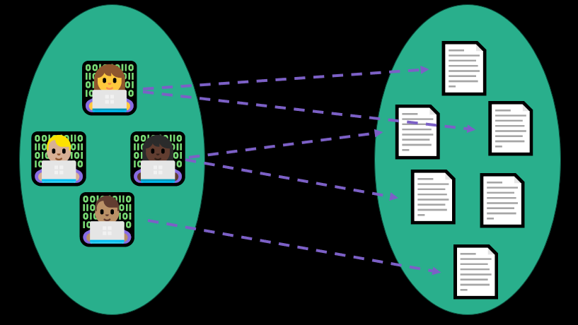
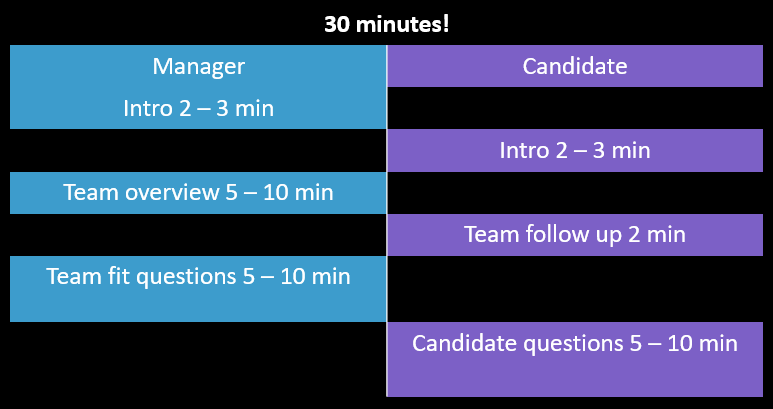
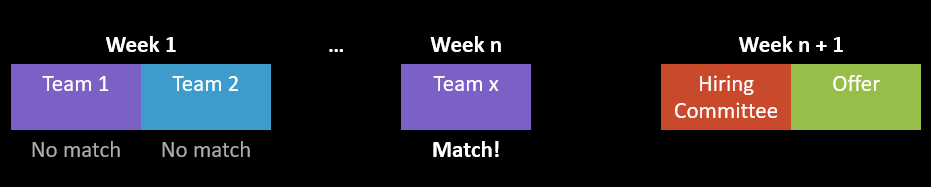
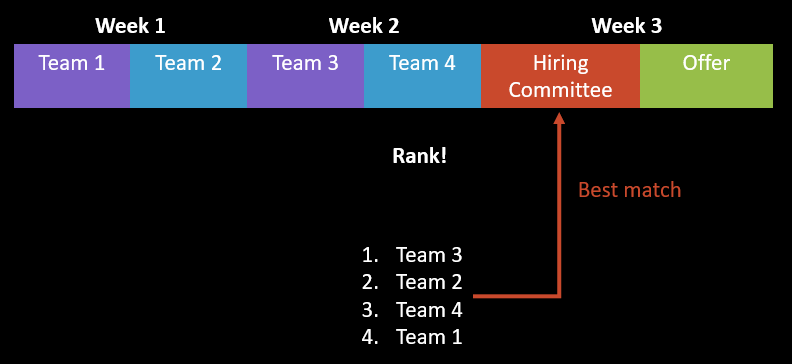

# Team matching

This article is an FAQ guide to the team matching process in the technical
hiring process for software engineers.

## What is team matching?

team matching is the process of matching a qualified candidate with one or more openings 
by having the candidate meet with multiple managers to identify a team fit. Managers will
ask you questions about your goals and experience to assess whether you are a good fit
for the team and if the team is a good fit for you. You will meet with one or more
managers, each with a position matching your experience.

## Can you pass or fail a team matching call?

Team matching isn't considered an interview because there is no skill assessment but
you are going to be pitching yourself as a teammate to potential managers. Managers
may be looking for a specific skill or previous experience that is more relevant
to their team. If you do not match with a team, it doesn't indicate that you made
any mistakes or weren't qualified.

## When does team matching happen?

Team matching happens after the completion of the technical interview rounds and
before the offer phase. **An offer is not guaranteed during team matching** even though
you'll have already passed the technical interviews.

## What are the steps of team matching?

Once you've passed your technical interviews, team matching will follow this rough
structure:
1. Recruiter tells you about one or more team opportunities
1. Recruiter sets up 30 min calls with hiring managers for one or more team opportunities
1. Recruiter asked if you are interested in moving forward with one or more teams. If there are multiple teams, you will be asked for your preference.

## What does a team matching call look like?

team matching calls are about 30 minutes and follow this rough agenda:
* Introductions: manager (1 - 3 min), candidate (1 - 3 min)
* Team overview: 10 min + time for follow up questions
* Manager questions to candidate (5 - 10 min)
* Candidate questions to manager (5 - 10 min)

Time is tight so make sure to have a concise introduction and set of questions going in.
It is possible to request an additional meeting if you have more questions but that will
take longer. Keep in mind that other candidates may also be matching with the same teams.

## How should I prepare for team matching?

Team matching is an opportunity for you to choose between different teams according
to your goals and preferences. Here are some things to prepare before entering team matching:

* A general idea of what types of projects you'd like to work on. Ex.: backend, frontend, data workflows, high scale, security, user facing, high collaboration, etc.
  * You can give your recruiter an idea of what types of teams you are interested in if you have preferences
* One or two career goals you want to work towards on your new team
* A 1 - 3 minute summary of your career experience to share with the potential manager
* Examples of how you like to collaborate with your team or manager
* 2 - 3 questions that will be tie-breakers between teams. Examples:
  * What project would I be working on when I join?
  * What are the team's core working hours?
  * What is the team operational load like?

The tie-breaking questions should focus on what's most important to you on a new team. Suggestions on areas to ask about:
* Work-life balance: core working hours, in-office expectations, frequency of meetings, on-call rotation
* Career growth: opportunities for promotion, access to mentors, availability of interesting projects, opportunities for training or learning, internal mobility
* Skills development: specific use of skills or technologies, ability to bring in new patterns or ideas
* Work and communication: synchronous vs. asynchronous commuication, slack vs. email vs. meetings, % time in meetings vs. focus, no meeting days

## How long does team matching take?

Unlike the other parts of the interview process, there is no set minimum or maximum number of
team matching calls. Depending on the style of team matching, it is a minimum of 1 - 3 weeks
or it could extend to months.

I've seen two approaches:

### First Match team matching

"First match" team matching is when you go into the offer phase for the first team
you match with - the first manager who wants to hire you and the first manager you want to
work with. This can be quick - 1 to 2 weeks - but it can be just as long as the "Best Match"
approach.

### Best Match team matching

In this approach, you have team matching calls with a small number of teams (2 - 4) and then you
are asked to rank them in order of preference. The recruiter will match you with your highest
choice that also matched with you. This will likely be longer than the "First Match" approach
due to having to meet with multiple teams regardless of how many you match with (at least 2 - 3 weeks). However, this
isn't guaranteed to take longer than "First Match".

## What happens after a match?

After you match with a team, a hiring committee meets to review your interview feedback.
The hiring committee consists of your interviewers, your recruiters, your manager, and any
others involved in the hiring process. The hiring committee will first make a hire/no-hire
decision. This is the point at which you will know if an offer is coming. Additionally,
they will discuss your job level and provide inputs into your compensation for your offer.

## What are benefits of team matching?

* Choose to work on something you are more interested in
* Find a manager you want to work with
* Choose a team aligned with your career goals
* Prioritize values and work life needs across multiple options
* Learn about the organization and company culture
* If the position for your application was filled, you have the opportunity to match
with other teams instead of re-applying

## What are the downsides of team matching?

* An offer is not guaranteed even though you have passed your interviews
* Team matching can take an unpredictable amount of time (weeks to months)
* It is possible that team matching won't find a match and you will not get an offer
* You may not match with the job posting you applied to

## Are other candidates matching with the same positions I am?

Yes. Managers are evaluating multiple candidates for the same position. This means
that the managers also have a choice of candidates.

## What happens when there are more candidates than open positions to match with?

In this case, some candidates will not receive an offer but as new openings are posted,
they may have the opportunity to match with those.

## Can I request to match with any opening on the job site?

You can request to match with a position but the recruiter primarily matches for
openings within their organization and matching occurs when a manager expresses interest
in a candidate based on their resume and interview performance.

## Team matching Tips

* Ask the recruiter if the interview process includes team matching
* Budget at least an extra 2 – 3 weeks of time for team matching
* Prepare an intro and questions for team matching
* Choose questions that will help you decide between teams
* Do not make plans assuming you will have an offer
* Be clear if your preferences are deal-breakers or if you’re flexible
